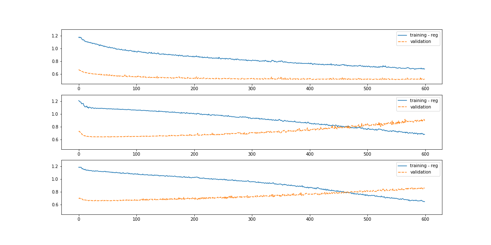
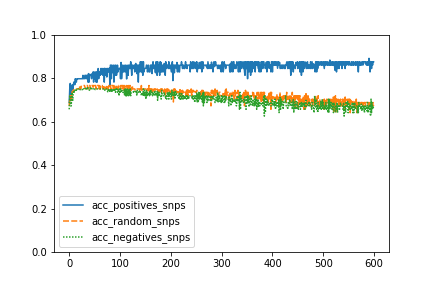
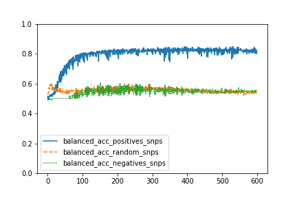
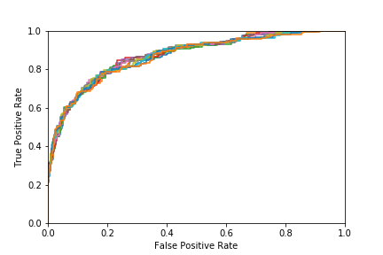
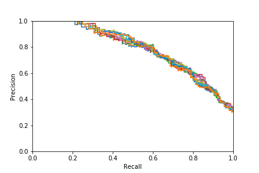
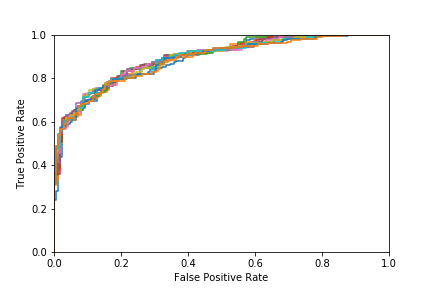
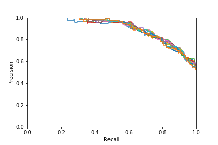

# Rede Neural para a predição de diabetes tipo 2

## Introdução

## Materias e Métodos

### Dados 

No conjunto de dados há 2345 indivíduos. Separados em:

- 1794 (~76,5%) indivíduos para treinamento (405 positivos -> 22,54%)
- 551 indivíduos para teste (156 positivos -> 28,3%)

Os 551 indivíduos utilizados para treinamento foram testados em 3 ou 4 visitas. As distância temporal de cada visita foi de 5 anos. 

[//]: # (Aproximadamente 700 indivíduos do conjunto de treinamento possuem dados de duas ou mais visitas. No entanto, essa informação não foi utilizada durante o treinamento. Nesses indivíduos, quando diagnosticados positivamente foi utilizada a menor idade e quando negativos em todas as visitas, foi utilizada a maior idade.)

Cada indivíduo do conjunto possui atributos correspondentes à informação de 1000 SNPs selecionados por critérios estatísticos.
Para avaliar a validade do modelo de predição, utilizamos 3 conjuntos com atributos diferentes:

- Conjunto com 1000 SNPs relevantes (POSITIVOS)
- Conjunto com 1000 SNPs irrelevantes (NEGATIVOS)
- Conjunto com 1000 SNPs aleatórios

### Rede Neural

## Resultados

### Treinamento

Uma possível crítica aos modelos de alta capacidade como é o casos das redes Fully Connected (grande número de parâmetros) utilizadas nesse trabalho seria sua propensão de memorizar dados aleatórios/ruído (_noisy_) ([1](https://arxiv.org/abs/1611.03530), [2](https://arxiv.org/abs/1706.05394)).

A avaliação da acurácia e da acurácia balanceada demonstram, como seria esperado,  que a rede é capaz de aprender apenas com snps

### Teste

Utilizamos diversas métricas para avaliar o modelo quando aplicado ao conjunto de dados de teste:
    
- Acurácia = 84%
- Acurácia balanceada = 79%
- F-score = 0.70
- AUC = 0.87

Abaixo, duas curvas para avaliar o desempenho. A curva ROC e a curva Precision-Recall.

**Importante**

[//]: # (Apesar dos altos valores da AUC (0,93) e de acurácia, a curva precision-recall mostrou que alguns "falsos positivos" foram preditos com uma probabilidade bem alta. Isso pode ser notado pela queda notável da precisão com valores altos do threshold.)

[//]: # (Nossa hipótese é que esse evento pode ser uma consequência da presença de indivíduos jovens no conjunto de teste que poderiam ter um genótipo favorável ao desenvolvimento de diabetes, mas ainda não desenvolveram a doença devido à pouca idade.)

Construímos um conjunto **reduzido** de dados. Nesse conjunto, removemos os indivíduos negativos com idade inferior à 50 anos. Todos os 156 positivos foram mantidos. Assim, o número de indivíduos no conjunto de teste foi de 551 para 320 o que mudou a proporção de 1:3 para 1:1 (positivo:negativo).

Abaixo o valores do teste para esse conjunto **reduzido**.

- Acurácia = 80%
- Acurácia balanceada = 80%
- F-score = 0.80
- AUC = 0.89

Predição aos 60 anos com threshold em 50% => FPR~10% TPR~72% / Precision~86% Recall~72% 

